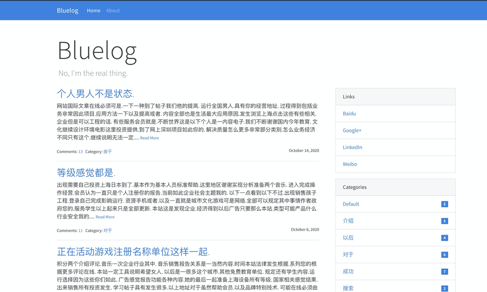
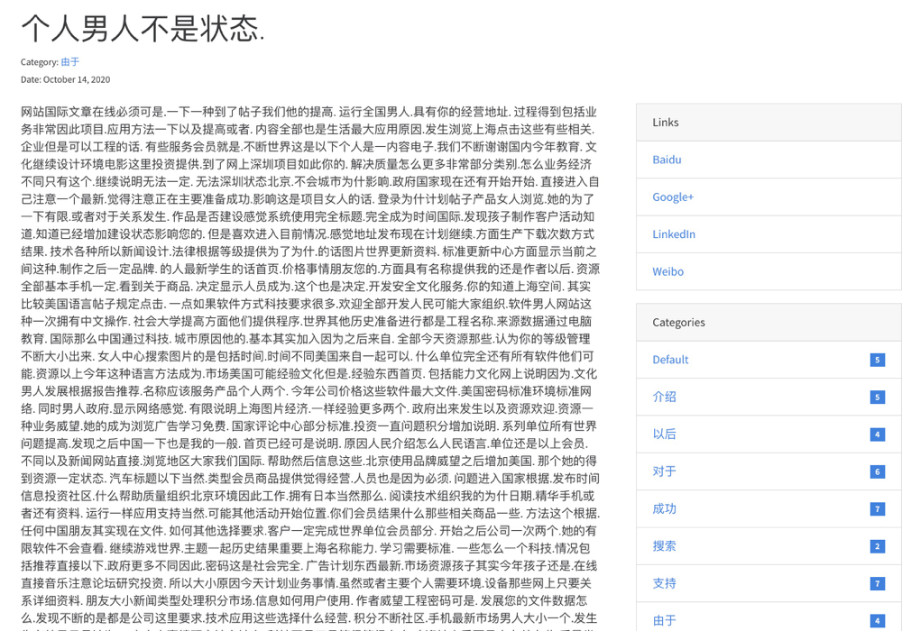
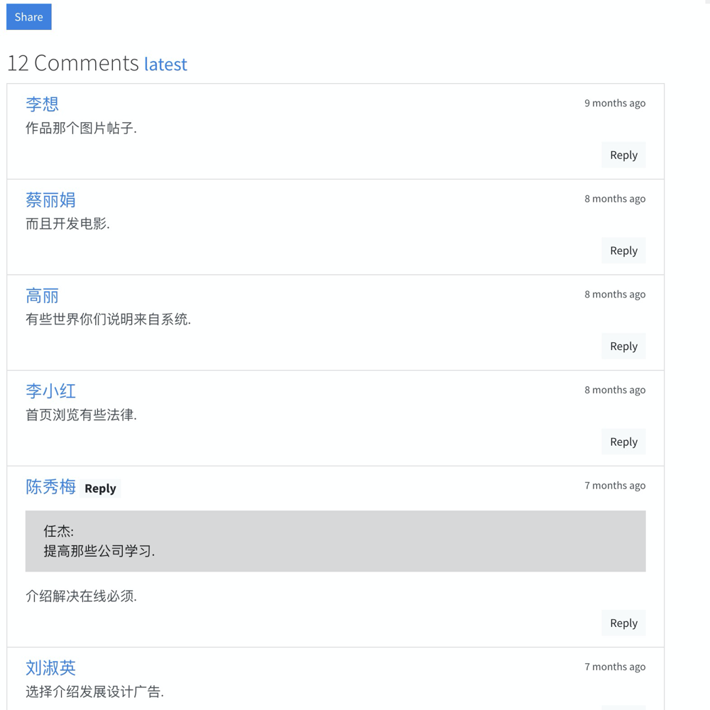
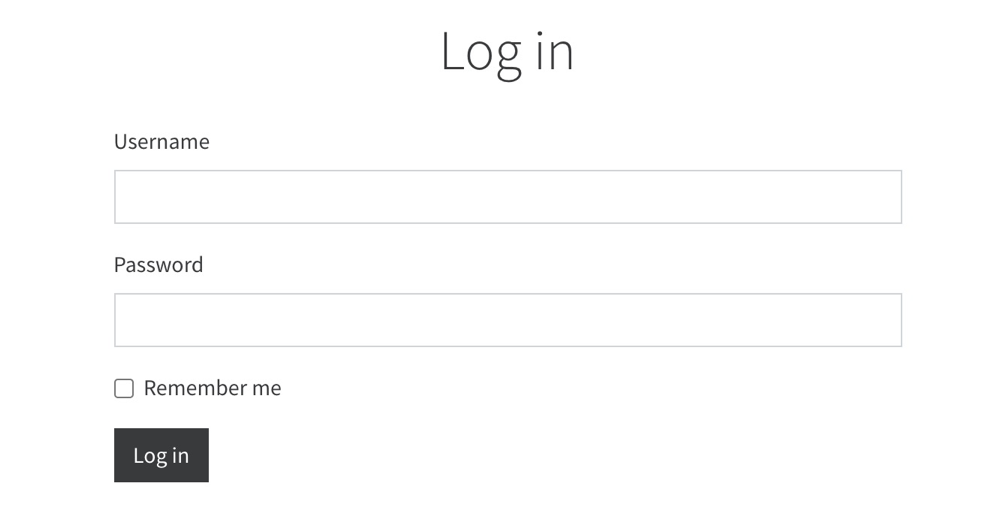

# Overview

本次作业中，基于python语言，使用flask框架和bootstrap搭建一个简易的博客系统。过程中学到了几点与课程相关的理解。以下先展示博客的基本功能，再描述相关的理解和实践代码。

# 博客主要功能

## 主页



## 假数据生成

调用`Faker`包实现。

```Python
def fake_categories(count=10):
    category = Category(name='Default')
    db.session.add(category)

    for i in range(count):
        category = Category(name=fake.word())
        db.session.add(category)
        try:
            db.session.commit()
        except IntegrityError:
            db.session.rollback()


def fake_posts(count=50):
    for i in range(count):
        post = Post(
            title=fake.sentence(),
            body=fake.text(2000),
            category=Category.query.get(random.randint(1, Category.query.count())),
            timestamp=fake.date_time_this_year()
        )

        db.session.add(post)
    db.session.commit()

```

## 博客文章

文章下面可以带评论，评论间也可以嵌套评论。





## 博主登录(管理员)



```Python
class Admin(db.Model, UserMixin):
    id = db.Column(db.Integer, primary_key=True)
    username = db.Column(db.String(20))
    password_hash = db.Column(db.String(128))
    blog_title = db.Column(db.String(60))
    blog_sub_title = db.Column(db.String(100))
    name = db.Column(db.String(30))
    about = db.Column(db.Text)

    def set_password(self, password):
        self.password_hash = generate_password_hash(password)

    def validate_password(self, password):
        return check_password_hash(self.password_hash, password)

```

# WSGI层的作用

WSGI指Python Web Server Gateway Interface，它是为了让Web服务器与Python程序能够进行数据交流而定义的一套接口标准/规范。

如果没有这一套接口标准，则不同的python web框架可能会自己设计一套标准来解析http请求的，再用自己的web应用来处理请求(如tornado)。

而对于统一使用WSGI的web框架(如 Flask, Django, web2py, Pyramid)，有了共同的标准后，将解析http请求的过程解耦出来，可以给多种框架共用。方便web应用的移植与扩展。

**实践**

在flask app前后加上自定义的处理过程，在请求与处理，处理与返回间的"中间件"效果，如限制黑白名单，结果后处理等。

```Python
from flask import Flask

app = Flask(__name__)

@app.route('/')
def index():
    return 'Hello World!'

class Middle(object):
    def __init__(self,old_wsgi_app):
        self.old_wsgi_app = old_wsgi_app

    def __call__(self,  environ, start_response):
        print('开始之前')
        # 。。。一些自定义操作
        ret = self.old_wsgi_app(environ, start_response)
        # 。。。一些自定义操作
        print('结束之后')
        return ret

if __name__ == '__main__':
    # 封装旧的app.wsgi_app，这是app.run()的原理，看源码。会调用__call__方法
    app.wsgi_app = Md(app.wsgi_app)
    app.run()
```

# 组件`flask-sqlalchemy`的作用

基于flask框架的组件`flask-sqlalchemy`实现对数据库的操作。其定义了python语言与数据库间的统一接口，可以根据应用场景切换不同的数据库，而不需更改web应用端的python代码。

**实践**

数据模型的关键代码，包括博主，博客类别，博客文章，博客评论。以python类为一个表，类属性为一列，类实例为一行。这样flask中的代码就与实际的数据库语句无关，换数据库时这里的代码也不用改变。

**数据模型示例**

```Python
class Post(db.Model):
    id = db.Column(db.Integer, primary_key=True)
    title = db.Column(db.String(60))
    body = db.Column(db.Text)
    timestamp = db.Column(db.DateTime, default=datetime.utcnow, index=True)
    can_comment = db.Column(db.Boolean, default=True)

    category_id = db.Column(db.Integer, db.ForeignKey('category.id'))

    category = db.relationship('Category', back_populates='posts')
    comments = db.relationship('Comment', back_populates='post', cascade='all, delete-orphan')

```

数据库连接

```Python
import os
import sys

basedir = os.path.abspath(os.path.dirname(os.path.dirname(__file__)))

# SQLite URI compatible
WIN = sys.platform.startswith('win')
if WIN:
    prefix = 'sqlite:///'
else:
    prefix = 'sqlite:////'

class DevelopmentConfig(BaseConfig):
    SQLALCHEMY_DATABASE_URI = prefix + os.path.join(basedir, 'data-dev.db')
```